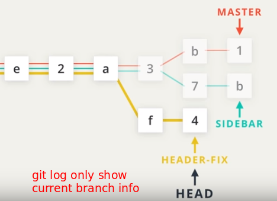
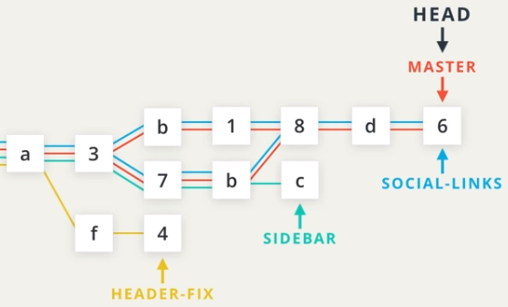
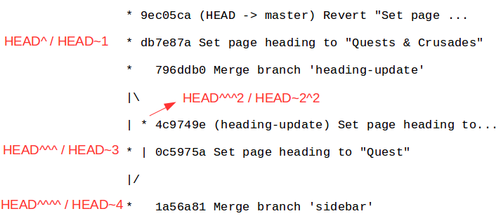
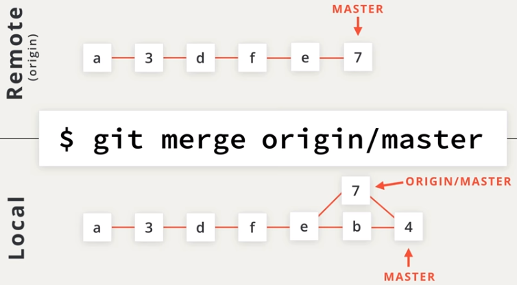
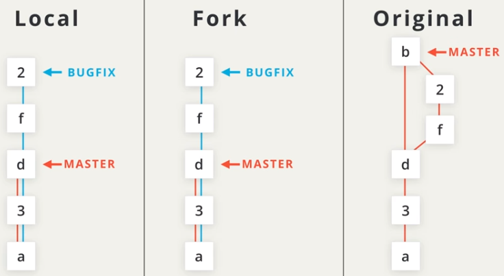
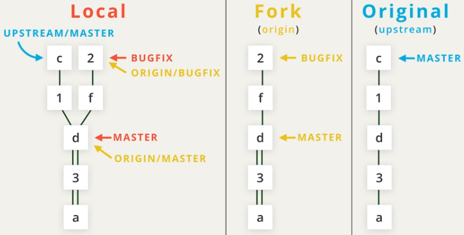
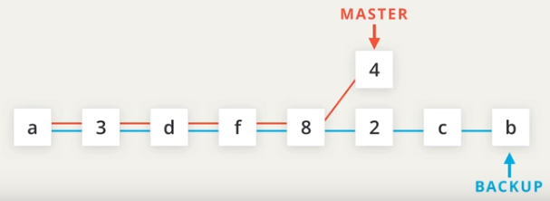

# Udacity Data Analyst Nano Degree

## Part 1: Git and GitHub

### Importance from Recruiter Perspective 

- Clear personal and repo information
- Nice activity heat map -->  passion on coding
- Informative README.md file of repo
  - Important for you / coworkers / end users / recruiter
  - Bad documentation will stop others using your code
  - **Principle of README**: communicate essential information for end user without assumption about what they already knows
    - what steps need to be taken?
    - what should the user already have installed or configured?
    - what might they have a hard time understanding right away?
- Formatted commit message

  - easier to maintain your code
  - well communication while contributing to  open source project
  - [Udacity Git Commit Style](https://udacity.github.io/git-styleguide/)
- Contributing to open source project -->  you are a collaborator
  - comment on pull request --> how interact with other engineer
  - answer issues especially to the new guys of the community
  - How to start?
    - start from update documentation like README with pull request
    - following the steps of README and try to clarify based on the problems you have
    - translate documentation into Chinese / English

### Git: Commands

- Create Repo
  - `git init` initial a folder as a new repo, tracking all modification under it
    - `.git/config` configure only for this repo
  - `git clone <path> [<new dir name>]`
    - cannot create nested repo, so do check your `pwd`
  - `git status`
- Review Commits
  - `git log` for commit history
    - `git log --oneline` show only 7 characters of SHA and commit
    - `git log --stat` show files changed for each commit
    - `git log --patch` or `git log -p` show the detailed changes of each commit
    - `git log -w` ignore the change of blank when showing patch info
    - `git log <7 character of SHA>` start from particular commit
  - `git show` show commit with knowing SHA
    - share all arguments of `git log`
- Make Commits
  - `git add` 
    - `git add .` to stage all folders and files
    - `git rm --cached <file>` to unstage
  - `git commit` open default editor
    - `git commit -m "commit message"` for short commit with only message
    - Rules of writing commits
      - Message: explain the role of submission
        - Good: "Update the footer to copyright information"
        - no why / no how / no and
      - Description: skip a line after message then start
  - `git diff` show changes of unstaged files
  - `.gitignore` file under repo to ignore specified files
- Develop on Branches
  - `git tag` show tag
    - `git tag -a v1.0 [<SHA>]` create a tag "v1.0" with comments (creator / date / message) for (optional) particular commit
    - `git tag -d "v1.0"` remove tag "v1.0"
    - use `git log` to verify the location of tag (use `--decorate` in older version)
  - `git branch` show all branches
    - `git branch <branch_name> [<SHA>]` create a new branch at (optional) particular commit
    - `git branch -d <branch_name>` delete branch (inactivate) w/o commit
      - to delete branch with commits, use `-D` instead
  - `git checkout` switch `HEAD` pointer to a branch, making it as active branch
    - convert file version to latest version of active branch (it replace all files under commit in previous branch, with that in the new branch)
    - `git checkout -b <new_branch_name> <create_on_which_branch>`  create a new branch and checkout it
    - 
  - `git log --oneline --graph --all` shows all branches and commits, also relationships
  - `git merge`
    - `git merge <other_branch>` merge a branch into current branch, like `master`
      - Fast-forward: moving `HEAD` to the latest commit (merge `social-links` to `master)`
      - Auto-merge: create a commit and merge (merge `sidebar` to `master`)
      - Merge conflicts: same row has been differently modified in both branches
        - git stop merging and return a single file, combining conflicting portions from both files, showing conflicts with indicators
        - update the file and commit it, then merge is completed automatically
        - you can just commit it and let merge done, but the conflicts will show in your file
      - 
    - `git reset --hard HEAD^` cancel merge
- Undo Changes
  - `git commit --amend` alter the most -recent commit
    - `git add` and run `git commit --amend` to add new files into last commit
  - `git revert <SHA>` create a new commit reversing given commit
  - Commit Reference
    - 
  - `git reset` erases commit
    - `git reset --mixed HEAD^^` move `HEAD` back to `HEAD^^`, and move changes of `HEAD^` into working dir (default)
    - `git reset --soft HEAD^^` move changes back to stage
    - `git reset --hard HEAD^^` delete changes
    - Backup strategy
      - before any `reset` operation, `git branch backup` 
      - after reset, if want to back to the starting point
        - `git checkout -- index.html` remove uncommited change to file "index.html"
        - `git merge backup` 

### Git: Shell Setting

1. [Lib of Setting optimized for Git](https://dotfiles.github.io/)
2. [Udacity style](https://classroom.udacity.com/nanodegrees/nd002-cn-advanced-career/parts/0f916a11-e0ae-4845-bb35-ee05bc7f1ac9/modules/63a3bbc1-bc00-4ee7-a894-a2d91841f30f/lessons/1b369991-f1ca-4d6a-ba8f-e8318d76322f/concepts/63a6f935-dea7-43c2-aaa3-61deea5070c8)

### GitHub: Remote Repo

- `git remote` show shortname of remote repo
  - `git remote -v` show detailed info
  - `git remote add <shortname> <repo_link>` add in repo link and its shortname
- `git push <remote_shortname> <remote_branch>` push all your local git info to remote repo
  - after `push` , `git log` will show the commit location of remote-tracking branch
- `git fetch <remote_shortname> <remote_branch>` download remote info and move remote-tracking 
- `git pull <remote_shortname> <remote_branch>` fetch and merge with local branch
- 

### GitHub: Collaborating with Fork

- `git shortlog` show commits under different collaborator
  - `git shortlog -s -n` show the number of commits only, sorted by large to small
- `git log --author="Paul Lewis"` show commits made by Paul Lewis
- `git log --grep="bug"` 
- How to contribute?
  - `Fork` the repo
  - Check CONTRIBUTION.md
  - To contribute large effort, use `Issues` to communicate with project maintenance before starting
  - Create branch with clear name meeting requirement
  - Create clear, frequent and small commits
  - Pull request

### GitHub: Keep Updated to Remote Repo

- Pull Request

  - 

- Fetch and Pull from Upstream

  - 

- `git rebase` transfer commits onto a new base

  - `git rebase -i HEAD~3` squash last three commits interactively (refer to [YouTube](https://www.youtube.com/watch?time_continue=222&v=cL6ehKtJLUM) for detailed setting)
    - need force `git push` due to deleting commits
  - Backup strategy: create backup branch before `rebase` 
  - 

## Part 1 Project: Stroop Effect

### T-score vs Z-score

- Z-distribution is exact normal distribution
- t-distribution is close to normal while $n\ge30$  [Animation](http://rpsychologist.com/d3/tdist/)
- Assumption of t-test [Reference](http://www.csic.cornell.edu/Elrod/t-test/t-test-assumptions.html)
  - Bivariate independent variable
  - Each observation of the dependent variable is independent of the other observations
    - Exception: for the paired t-test, we only require that the pair-differences (Ai - Bi) be independent from each other (across i)
  - **Dependent variable has a normal distribution**

### Understanding of p-value

